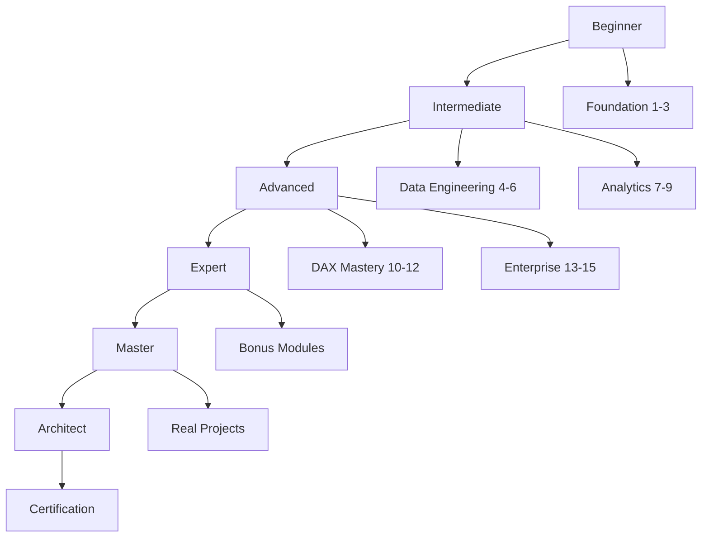

# Power BI Business Analytics - Learning Path

## 🎯 ภาพรวม Learning Path

หลักสูตรนี้แบ่งเป็น 6 ระดับการเรียนรู้ แต่ละระดับมีวัตถุประสงค์และทักษะที่แตกต่างกัน

## 📊 Learning Path Overview

## 🚀 Level 1: Beginner (20-30 ชั่วโมง)

### วัตถุประสงค์
เข้าใจพื้นฐาน Power BI และสามารถสร้างรายงานง่ายๆ ได้

### Modules ที่ต้องเรียน
- [x] **Module 1**: Power BI Ecosystem & Architecture
- [x] **Module 2**: Advanced Desktop Interface  
- [x] **Module 3**: Data Sources & Connections

### ทักษะที่ได้
- ✅ เข้าใจ Power BI Architecture
- ✅ ใช้งาน Desktop Interface ได้
- ✅ เชื่อมต่อข้อมูลพื้นฐานได้
- ✅ สร้างรายงานง่ายๆ ได้

### Projects
1. **Project 1**: สร้าง Sales Dashboard พื้นฐาน
2. **Project 2**: สร้าง Financial Report
3. **Project 3**: สร้าง HR Dashboard

### Assessment
- [ ] Quiz: Power BI Fundamentals
- [ ] Practical: สร้างรายงาน 3 รายการ
- [ ] Presentation: นำเสนอผลงาน

## 🔧 Level 2: Intermediate (40-60 ชั่วโมง)

### วัตถุประสงค์
สามารถจัดการข้อมูลและสร้าง Visualizations ขั้นสูงได้

### Modules ที่ต้องเรียน
- [x] **Module 4**: Power Query Mastery
- [x] **Module 5**: Advanced Data Transformation
- [x] **Module 6**: Data Modeling Excellence
- [x] **Module 7**: Advanced Visualizations
- [x] **Module 8**: Custom Visuals & R/Python
- [x] **Module 9**: Report Design Mastery

### ทักษะที่ได้
- ✅ ใช้ Power Query ได้อย่างเชี่ยวชาญ
- ✅ สร้าง Data Model ที่มีประสิทธิภาพ
- ✅ สร้าง Advanced Visualizations
- ✅ ใช้ Custom Visuals และ R/Python
- ✅ ออกแบบรายงานที่มีประสิทธิภาพ

### Projects
1. **Project 4**: Data Pipeline ที่สมบูรณ์
2. **Project 5**: Interactive Dashboard
3. **Project 6**: Custom Visual Development

### Assessment
- [ ] Quiz: Data Engineering & Visualization
- [ ] Practical: สร้าง Data Pipeline
- [ ] Code Review: Custom Visuals

## 💡 Level 3: Advanced (60-80 ชั่วโมง)

### วัตถุประสงค์
เชี่ยวชาญ DAX และสามารถสร้างการคำนวณที่ซับซ้อนได้

### Modules ที่ต้องเรียน
- [x] **Module 10**: DAX Fundamentals
- [x] **Module 11**: Advanced DAX Functions
- [x] **Module 12**: Performance & Optimization
- [x] **Module 13**: Power BI Service & Premium
- [x] **Module 14**: Security & Governance
- [x] **Module 15**: Best Practices & Architecture

### ทักษะที่ได้
- ✅ เขียน DAX ที่ซับซ้อนได้
- ✅ เพิ่มประสิทธิภาพ Performance
- ✅ จัดการ Power BI Service
- ✅ วางแผน Security และ Governance
- ✅ ใช้ Best Practices

### Projects
1. **Project 7**: Advanced Analytics Dashboard
2. **Project 8**: Enterprise Data Model
3. **Project 9**: Performance Optimization

### Assessment
- [ ] Quiz: DAX & Performance
- [ ] Practical: Enterprise Project
- [ ] Case Study: Real-world Scenario

## 🎓 Level 4: Expert (80-100 ชั่วโมง)

### วัตถุประสงค์
เชี่ยวชาญ Power Platform และสามารถบูรณาการกับระบบอื่นได้

### Modules ที่ต้องเรียน
- [x] **Bonus 1**: Power Platform Integration
- [x] **Bonus 2**: AI & Machine Learning
- [x] **Bonus 3**: Real-world Case Studies

### ทักษะที่ได้
- ✅ บูรณาการ Power Platform
- ✅ ใช้ AI และ Machine Learning
- ✅ แก้ไขปัญหาในโลกจริง
- ✅ ให้คำปรึกษาและฝึกอบรม

### Projects
1. **Project 10**: Power Platform Solution
2. **Project 11**: AI-Powered Analytics
3. **Project 12**: Enterprise Implementation

### Assessment
- [ ] Quiz: Power Platform & AI
- [ ] Practical: Complete Solution
- [ ] Presentation: Expert Level

## 🏆 Level 5: Master (100+ ชั่วโมง)

### วัตถุประสงค์
เป็น Master ใน Power BI และสามารถสร้างนวัตกรรมได้

### กิจกรรม
- [ ] **Real-world Projects**: โครงการจริงกับลูกค้า
- [ ] **Mentoring**: ฝึกสอนผู้อื่น
- [ ] **Community**: มีส่วนร่วมใน Community
- [ ] **Innovation**: สร้างนวัตกรรมใหม่

### ทักษะที่ได้
- ✅ Leadership ใน Power BI
- ✅ Innovation และ Creativity
- ✅ Teaching และ Mentoring
- ✅ Community Building

## 🎯 Level 6: Architect (120+ ชั่วโมง)

### วัตถุประสงค์
เป็น Power BI Architect และสามารถออกแบบระบบระดับองค์กรได้

### กิจกรรม
- [ ] **Enterprise Architecture**: ออกแบบระบบระดับองค์กร
- [ ] **Strategy Planning**: วางแผนกลยุทธ์ BI
- [ ] **Certification**: ได้รับ Microsoft Certifications
- [ ] **Thought Leadership**: เป็นผู้นำความคิด

### ทักษะที่ได้
- ✅ Enterprise Architecture
- ✅ Strategic Planning
- ✅ Industry Expertise
- ✅ Thought Leadership

## 📋 Prerequisites สำหรับแต่ละ Level

### Level 1: Beginner
- ความรู้พื้นฐานคอมพิวเตอร์
- ความรู้พื้นฐาน Excel (แนะนำ)
- ความเข้าใจพื้นฐาน Business Intelligence

### Level 2: Intermediate
- ผ่าน Level 1
- ความรู้พื้นฐาน Database
- ความรู้พื้นฐาน Statistics (แนะนำ)

### Level 3: Advanced
- ผ่าน Level 2
- ความรู้ SQL (แนะนำ)
- ความรู้ Programming (แนะนำ)

### Level 4: Expert
- ผ่าน Level 3
- ความรู้ Cloud Computing
- ความรู้ Machine Learning (แนะนำ)

### Level 5: Master
- ผ่าน Level 4
- ประสบการณ์การทำงานจริง
- ทักษะ Leadership

### Level 6: Architect
- ผ่าน Level 5
- ประสบการณ์ Enterprise
- Microsoft Certifications

## 🎯 Learning Objectives โดย Level

### Level 1: Foundation
- เข้าใจ Power BI Ecosystem
- ใช้งาน Desktop Interface
- เชื่อมต่อข้อมูลพื้นฐาน
- สร้างรายงานง่ายๆ

### Level 2: Data & Visualization
- จัดการข้อมูลขั้นสูง
- สร้าง Data Model
- สร้าง Advanced Visualizations
- ออกแบบรายงาน

### Level 3: Analytics & Performance
- เขียน DAX ขั้นสูง
- เพิ่มประสิทธิภาพ
- จัดการ Enterprise Features
- วางแผน Security

### Level 4: Integration & AI
- บูรณาการ Power Platform
- ใช้ AI และ ML
- แก้ไขปัญหาจริง
- ให้คำปรึกษา

### Level 5: Leadership
- นำทีม Power BI
- สร้างนวัตกรรม
- ฝึกสอนผู้อื่น
- สร้าง Community

### Level 6: Architecture
- ออกแบบระบบองค์กร
- วางแผนกลยุทธ์
- เป็น Thought Leader
- ได้รับ Certifications

## 📊 Time Investment

| Level | Hours | Duration (Part-time) | Duration (Full-time) |
|-------|-------|---------------------|---------------------|
| Level 1 | 20-30 | 2-3 เดือน | 2-3 สัปดาห์ |
| Level 2 | 40-60 | 4-6 เดือน | 1-2 เดือน |
| Level 3 | 60-80 | 6-8 เดือน | 2-3 เดือน |
| Level 4 | 80-100 | 8-10 เดือน | 3-4 เดือน |
| Level 5 | 100+ | 10+ เดือน | 4+ เดือน |
| Level 6 | 120+ | 12+ เดือน | 5+ เดือน |

## 🎯 Success Metrics

### Technical Skills
- [ ] สามารถสร้างรายงานที่ซับซ้อนได้
- [ ] เขียน DAX ที่มีประสิทธิภาพได้
- [ ] ออกแบบ Data Model ที่ดีได้
- [ ] เพิ่มประสิทธิภาพ Performance ได้

### Business Skills
- [ ] เข้าใจ Business Requirements
- [ ] สื่อสารกับ Stakeholders ได้
- [ ] ให้คำปรึกษาได้
- [ ] วางแผนกลยุทธ์ได้

### Soft Skills
- [ ] การนำเสนอผลงาน
- [ ] การทำงานเป็นทีม
- [ ] การแก้ไขปัญหา
- [ ] การเรียนรู้อย่างต่อเนื่อง

## 🔄 Continuous Learning

### Monthly Activities
- [ ] อ่าน Power BI Blog
- [ ] เข้าร่วม Community Events
- [ ] ฝึกใช้ Features ใหม่
- [ ] แชร์ความรู้

### Quarterly Activities
- [ ] เรียน Course ใหม่
- [ ] ทำ Project ใหม่
- [ ] เขียน Blog หรือ Article
- [ ] ให้คำปรึกษา

### Yearly Activities
- [ ] สอบ Microsoft Certification
- [ ] เข้าร่วม Conference
- [ ] สร้าง Portfolio
- [ ] วางแผน Career Path

---

**หมายเหตุ**: Learning Path นี้เป็นแนวทางที่แนะนำ ผู้เรียนสามารถปรับแต่งตามความต้องการและประสบการณ์ของตนเองได้
