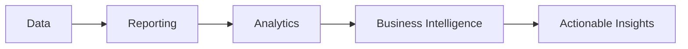

# Module 1: Power BI Business Intelligence Overview (1 ชั่วโมง)

## 🎯 วัตถุประสงค์การเรียนรู้
เมื่อจบบทนี้ ผู้เรียนจะสามารถ:
- เข้าใจ Business Intelligence และคุณค่าต่อธุรกิจ
- รู้จัก Power BI Ecosystem และ Architecture
- เข้าใจ AdventureWorksDW Business Context
- วางแผน Real-world BI Implementation Strategy
- ประเมิน ROI และ Business Value ของ BI Projects

## 📚 เนื้อหาบทเรียน (60 นาที)

### 1.1 Business Intelligence Fundamentals (15 นาที)

#### 1.1.1 What is Business Intelligence?
- **คำนิยาม**: การเปลี่ยนข้อมูลเป็นข้อมูลเชิงลึกที่นำไปใช้ได้
- **Business Value**: การสนับสนุนการตัดสินใจทางธุรกิจ
- **ROI**: การวัดผลตอบแทนการลงทุน
- **Success Metrics**: ตัวชี้วัดความสำเร็จ

#### 1.1.2 BI vs Analytics vs Reporting


#### 1.1.3 Business Intelligence Benefits
- **Faster Decision Making**: การตัดสินใจที่รวดเร็วขึ้น
- **Improved Efficiency**: ประสิทธิภาพที่ดีขึ้น
- **Competitive Advantage**: ข้อได้เปรียบทางการแข่งขัน
- **Data-Driven Culture**: วัฒนธรรมที่ขับเคลื่อนด้วยข้อมูล

### 1.2 Power BI Ecosystem & Architecture (15 นาที)

#### 1.2.1 Power BI Components
- **Power BI Desktop**: Development Environment
- **Power BI Service**: Cloud Platform
- **Power BI Mobile**: Mobile Applications
- **Power BI Gateway**: On-premises Connectivity
- **Power BI Embedded**: Embedded Analytics

#### 1.2.2 Power BI Architecture
```
Data Sources → Power BI Gateway → Power BI Service → Power BI Mobile
     ↓              ↓                    ↓              ↓
  SQL Server    Data Gateway        Dashboards      Mobile Apps
  Excel         Security            Reports         Offline Access
  APIs          Refresh             Workspaces      Notifications
```

#### 1.2.3 Licensing & Pricing
- **Free**: Personal use
- **Pro**: Individual users ($10/user/month)
- **Premium Per User (PPU)**: Advanced features ($20/user/month)
- **Premium Per Capacity**: Organization-wide ($4,995/month)

### 1.3 AdventureWorksDW Business Context (15 นาที)

#### 1.3.1 AdventureWorksDW Overview
- **Business**: AdventureWorks Cycles - Bicycle Manufacturer
- **Products**: Bicycles, Components, Accessories
- **Markets**: North America, Europe, Asia
- **Time Period**: 2005-2014 (10 years of data)

#### 1.3.2 Key Business Areas
```sql
-- Sales Analysis
SELECT 
    ProductCategory,
    SUM(SalesAmount) as TotalSales,
    COUNT(DISTINCT CustomerKey) as CustomerCount
FROM FactInternetSales fis
JOIN DimProduct p ON fis.ProductKey = p.ProductKey
JOIN DimProductCategory pc ON p.ProductCategoryKey = pc.ProductCategoryKey
GROUP BY ProductCategory
ORDER BY TotalSales DESC
```

#### 1.3.3 Business Questions We'll Answer
- **Sales Performance**: How are we performing against targets?
- **Customer Analysis**: Who are our best customers?
- **Product Performance**: Which products are most profitable?
- **Geographic Analysis**: Where should we focus our efforts?
- **Seasonal Trends**: When do we see peak sales?

### 1.4 Real-world BI Implementation Strategy (15 นาที)

#### 1.4.1 Implementation Phases
1. **Phase 1: Foundation** (Weeks 1-4)
   - Data discovery and assessment
   - Technical infrastructure setup
   - Initial pilot project

2. **Phase 2: Development** (Weeks 5-12)
   - Core dashboards and reports
   - User training and adoption
   - Feedback and iteration

3. **Phase 3: Scale** (Weeks 13-24)
   - Enterprise deployment
   - Advanced analytics
   - Self-service capabilities

4. **Phase 4: Optimize** (Ongoing)
   - Performance optimization
   - Advanced features
   - Continuous improvement

#### 1.4.2 Success Factors
- **Executive Sponsorship**: การสนับสนุนจากผู้บริหาร
- **Data Quality**: คุณภาพข้อมูล
- **User Training**: การฝึกอบรมผู้ใช้
- **Change Management**: การจัดการการเปลี่ยนแปลง

#### 1.4.3 Common Pitfalls
- **Poor Data Quality**: ข้อมูลคุณภาพต่ำ
- **Lack of User Adoption**: ผู้ใช้ไม่ยอมรับ
- **Over-engineering**: วิศวกรรมเกินความจำเป็น
- **Insufficient Training**: การฝึกอบรมไม่เพียงพอ

## 🛠️ การปฏิบัติ (30 นาที)

### Lab 1: Business Intelligence Assessment (15 นาที)
1. **Current State Analysis**
   - วิเคราะห์ระบบ BI ปัจจุบัน
   - ระบุ Pain Points
   - ประเมิน Data Quality

2. **Business Requirements**
   - ระบุ Business Questions
   - กำหนด KPIs
   - สร้าง Success Metrics

### Lab 2: Power BI Environment Setup (15 นาที)
1. **Install Power BI Desktop**
   - Download และติดตั้ง
   - ตั้งค่า Preferences
   - ทดสอบการทำงาน

2. **Connect to AdventureWorksDW**
   - เชื่อมต่อกับฐานข้อมูล
   - สำรวจข้อมูล
   - ทดสอบ Query

## 📊 ข้อมูลตัวอย่าง

### AdventureWorksDW Business Scenarios
- **Sales Performance**: การวิเคราะห์ประสิทธิภาพยอดขาย
- **Customer Intelligence**: การวิเคราะห์ลูกค้า
- **Product Analytics**: การวิเคราะห์ผลิตภัณฑ์
- **Financial Reporting**: รายงานทางการเงิน
- **Supply Chain**: การวิเคราะห์ห่วงโซ่อุปทาน

### Key Business Metrics
- **Revenue**: รายได้
- **Profit Margin**: กำไร
- **Customer Acquisition Cost**: ต้นทุนการได้ลูกค้า
- **Customer Lifetime Value**: มูลค่าลูกค้าตลอดชีพ
- **Inventory Turnover**: การหมุนเวียนสินค้าคงคลัง

## 🎯 แบบฝึกหัด

### Exercise 1: Business Intelligence Strategy
**สถานการณ์**: บริษัทต้องการเริ่มต้น BI Project

**งาน**:
1. วิเคราะห์ Business Requirements
2. วางแผน Implementation Strategy
3. ประเมิน ROI และ Business Value
4. สร้าง Project Timeline

### Exercise 2: Power BI Architecture Design
**สถานการณ์**: ออกแบบ Power BI Architecture สำหรับองค์กร

**งาน**:
1. ออกแบบ Architecture
2. เลือก Licensing Model
3. วางแผน Security
4. กำหนด Governance

## 📝 สรุป

### สิ่งที่เราได้เรียนรู้:
- Business Intelligence และคุณค่าต่อธุรกิจ
- Power BI Ecosystem และ Architecture
- AdventureWorksDW Business Context
- Real-world BI Implementation Strategy

### สิ่งที่จะเรียนต่อไป:
- AdventureWorksDW Data Sources
- Power Query & Data Transformation
- Sales Analytics Dashboard

## 🔗 ลิงก์ที่เป็นประโยชน์

- [Power BI Business Intelligence](https://powerbi.microsoft.com/en-us/what-is-business-intelligence/)
- [AdventureWorks Sample Databases](https://docs.microsoft.com/en-us/sql/samples/adventureworks-install-configure)
- [Power BI Licensing](https://powerbi.microsoft.com/en-us/pricing/)
- [BI Implementation Best Practices](https://docs.microsoft.com/en-us/power-bi/guidance/whitepaper-powerbi-implementation-planning)

## 📞 คำถามที่พบบ่อย

**Q: Power BI เหมาะกับธุรกิจขนาดไหน?**
A: เหมาะกับทุกขนาด ตั้งแต่ SME จนถึง Enterprise

**Q: ROI ของ Power BI เป็นอย่างไร?**
A: โดยเฉลี่ย ROI อยู่ที่ 300-400% ภายใน 12 เดือน

**Q: ต้องใช้เวลาเท่าไหร่ในการ Implement?**
A: ขึ้นอยู่กับขนาด แต่โดยทั่วไป 3-6 เดือนสำหรับโครงการขนาดกลาง

---

**หมายเหตุ**: Module นี้เป็นพื้นฐานสำคัญสำหรับการเข้าใจ Business Intelligence และ Power BI ในบริบททางธุรกิจ

